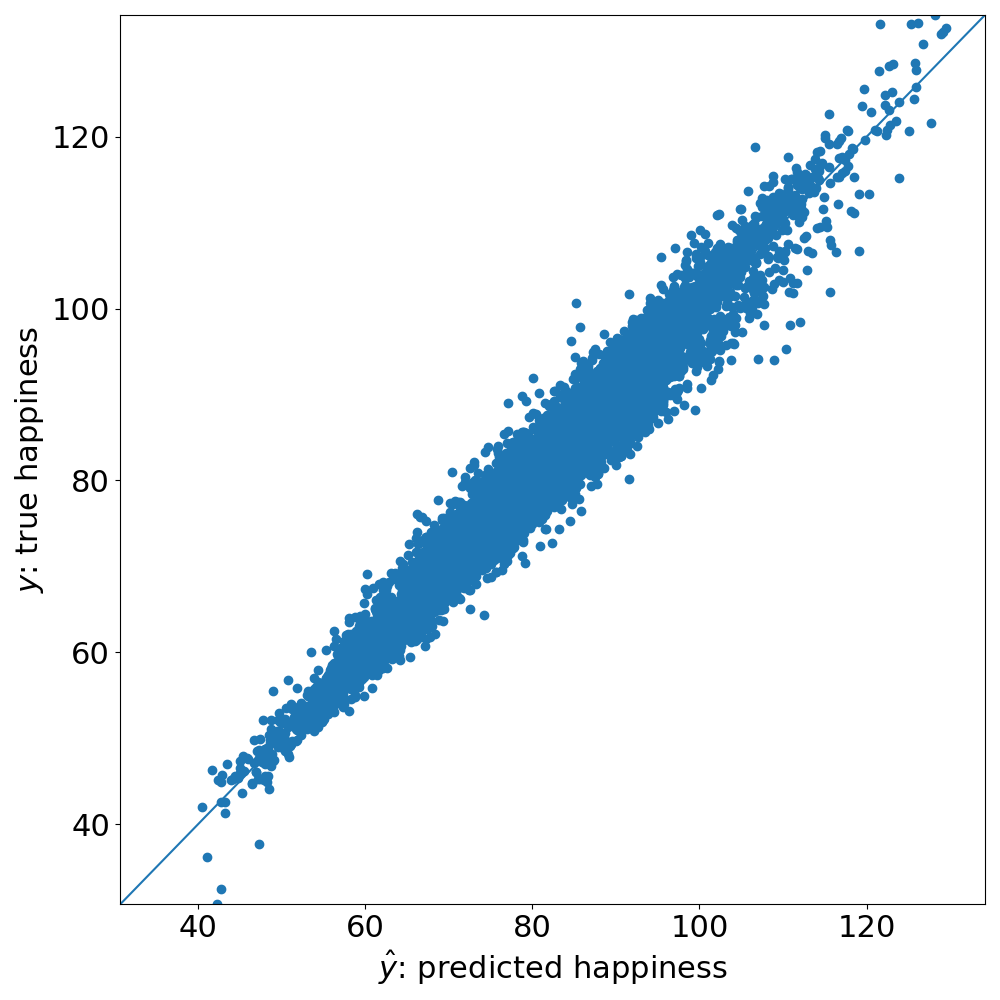

<!-- _color: "white" -->
<!-- _footer: ''-->
<!-- _header: ''-->

<!-- _paginate: skip -->

# CATEring to Causal Inference: An Introduction to `metalearners`

## Flexible MetaLearners in Python

Francesc Martí Escofet (@fmartiescofet)
Kevin Klein (@kevkle)

---

<!-- _footer: ''-->
<!-- _header: ''-->


---

## Let the data decide!

- We not only want to predict what happens in a world in which we don't have influence on the environment/data generating process.

- Rather, we want to **decide** which **intervention** to choose.

- Intuitively, in order to decide, we'd like to **compare the 'outcomes'** if taking the blue pill compared to the outcome of taking the red pill.
  $$Y(\text{blue pill}) - Y(\text{red pill})$$

---

## The data

- We have empirical **data** on individuals, who have

  - had their **properties**/covariates evaluated at the time of the intervention
  - been subject to the **intervention** (taking either of both pills)
  - had the **outcome** of their happiness measured, 5 years after the intervention

---

## The data, more formally

Our experiment data contains three different kinds of quantities per individual $i$:

| Name         | Symbol | Definition                                                                    |
| ------------ | ------ | ----------------------------------------------------------------------------- |
| Covariates   | $X_i$  | Properties of the time of intervention                                        |
| Intervention | $W_i$  | $\begin{cases} 1 & \text{if red pill} \\ 0 & \text{if blue pill} \end{cases}$ |
| Outcome      | $Y_i$  | Happiness score ($\mathbb{R}$) 5 years after intervention                     |

$\mathcal{D} = \{ (X_i, W_i, Y_i)\}$

---

## $X$: Properties/covariates

|         | age | #phil books | dominant personality trait | education | atheist | ... |
| ------- | --- | ----------- | -------------------------- | --------- | ------- | --- |
| Anne    | 85  | 14          | extraversion               | BA        | 1       | ... |
| Bob     | 17  | 1           | openness                   | HS        | 0       | ... |
| Charlie | 34  | 0           | conscientiousness          | PhD       | 1       | ... |
| ...     | ... | ...         | ...                        | ...       | ...     | ... |

<!-- Big five personality traits:
Openness, coscientiousness, extraversion, agreeableness, neurotocism
-->

---

## Treatment effects

Many Causal Inference techniques allow for the estimation of the **Average Treatment Effect**

$$\mathbb{E}[Y(\text{blue pill}) - Y(\text{red pill})]$$

---

<!-- _footer: ''-->
<!-- _header: ''-->


---


---


---

## Capturing heterogeneity

Instead of estimating

$$\mathbb{E}[Y(\text{blue pill}) - Y(\text{red pill})]$$

we'd like to estimate

$$Y_i(\text{blue pill}) - Y_i(\text{red pill})$$

---

## But how?

In an ideal world:

|         | age | #phil books | ... | $Y(\text{blue pill)}$ | $Y(\text{red pill})$ | $\tau$ |
| ------- | --- | ----------- | --- | --------------------- | -------------------- | ------ |
| Anne    | 85  | 14          | ... | 15.8                  | 13.2                 | 2.6    |
| Bob     | 17  | 1           | ... | 32.3                  | 32.4                 | -0.1   |
| Charlie | 34  | 0           | ... | 7.0                   | 9.2                  | -2.2   |
| ...     | ... | ...         | ... | ...                   | ...                  | ...    |

<p style="visibility:hidden"> The <strong>fundamental problem of Causal Inference</strong> states that we can never observe $Y(\text{blue pill})$ and $Y(\text{red pill})$ simultaneously for the same 'unit'. <p>

<!-- This would be just another regression problem -->

---

## But how?

In reality:

|         | age | #phil books | ... | $Y(\text{blue pill)}$             | $Y(\text{red pill})$              | $\tau$                            |
| ------- | --- | ----------- | --- | --------------------------------- | --------------------------------- | --------------------------------- |
| Anne    | 85  | 14          | ... | 15.8                              | <span style="color:red;">?</span> | <span style="color:red;">?</span> |
| Bob     | 17  | 1           | ... | <span style="color:red;">?</span> | 32.4                              | <span style="color:red;">?</span> |
| Charlie | 34  | 0           | ... | <span style="color:red;">?</span> | 9.2                               | <span style="color:red;">?</span> |
| ...     | ... | ...         | ... | ...                               | ...                               | ...                               |

The **fundamental problem of Causal Inference** states that we can never observe $Y(\text{blue pill})$ and $Y(\text{red pill})$ simultaneously for the same 'unit'.

<!-- This is not an off-the-shelf prediction problem -->

---

## What now?

- We can't know the Individual Treatment Effect (ITE)
  $$Y_i(\text{blue pill}) - Y_i(\text{red pill})$$
- Yet, we **can estimate** the **Conditional Average Treatment Effect (CATE)**
  $$\tau(X) := \mathbb{E}[Y(\text{blue pill}) - Y(\text{red pill})|X]$$
  - Note the difference from the Average Treatment Effect
    $$\mathbb{E}[Y(\text{blue pill}) - Y(\text{red pill})]$$

---

## Learning a policy

In order to get to a **decision** as to give what pill to whom, we can now follow the following process:

1. Estimate CATEs $\hat{\tau}(X) = \mathbb{E}[Y(\text{blue pill}) - Y(\text{red pill}) | X]$
2. Distribute pills according to this policy:
   $\pi(X) := \begin{cases} \text{blue pill} & \text{if } \hat{\tau}(X) \geq 0 \\ \text{red pill} & \text{if }\hat{\tau}(X) < 0 \end{cases}$

---

## Estimating CATEs

- There are various approaches for estimating CATEs.
- MetaLearners are a family of approaches for estimating CATEs.
  - Work by [Chernozhukov(2016)](https://arxiv.org/abs/1608.00060), [Nie(2017)](https://arxiv.org/pdf/1712.04912), [Kunzel(2017)](https://arxiv.org/pdf/1706.03461), [Kennedy(2020)](https://arxiv.org/pdf/2004.14497) and more.

---

## MetaLearners


- MetaLearners are **CATE models** which rely on typical, **arbitrary machine learning estimators** (classifiers or regressors) as **components**.
- Some examples include the S-Learner, T-Learner, F-Learner, X-Learner, R-Learner, M-Learner and DR-Learner.

---

## MetaLearners


- Input
  - $W$: Treatment assignments
  - $X$: Covariates/features
  - $Y$: Outcomes
- Output
  - $\hat{\tau}(X)$: CATE estimates

---

## Creating a first MetaLearner

<div data-marpit-fragment>

```python
from metalearners import RLearner
from lightgbm import LGBMRegressor, LGBMClassifier
```

</div>
<div data-marpit-fragment>

<marp-pre is="marp-pre" data-auto-scaling="downscale-only"><code class="language-python">rlearner = RLearner(
<span style="color:orange">&nbsp;&nbsp;&nbsp;&nbsp;nuisance_model_factory=LGBMRegressor,
&nbsp;&nbsp;&nbsp;&nbsp;propensity_model_factory=LGBMClassifier,
&nbsp;&nbsp;&nbsp;&nbsp;treatment_model_factory=LGBMRegressor,</span>
&nbsp;&nbsp;&nbsp;&nbsp;is_classification=<span class="hljs-literal">False</span>,
&nbsp;&nbsp;&nbsp;&nbsp;n_variants=<span class="hljs-number">2</span>,
)
</code></marp-pre>

</div>
<div style="visibility: hidden">

```python
rlearner.fit(
    X=df[feature_columns], y=df[outcome_column], w=df[treatment_column]
)
```

</div>

---

## Creating a first MetaLearner

<div>

```python
from metalearners import RLearner
from lightgbm import LGBMRegressor, LGBMClassifier
```

</div>
<div>

<marp-pre is="marp-pre" data-auto-scaling="downscale-only"><code class="language-python">rlearner = RLearner(
&nbsp;&nbsp;&nbsp;&nbsp;nuisance_model_factory=LGBMRegressor,
&nbsp;&nbsp;&nbsp;&nbsp;propensity_model_factory=LGBMClassifier,
&nbsp;&nbsp;&nbsp;&nbsp;treatment_model_factory=LGBMRegressor,
<span style="color:orange">&nbsp;&nbsp;&nbsp;&nbsp;is_classification=<span class="hljs-literal">False</span>,
&nbsp;&nbsp;&nbsp;&nbsp;n_variants=<span class="hljs-number">2</span>,</span>
)
</code></marp-pre>

</div>
<div data-marpit-fragment>

```python
rlearner.fit(
    X=df[feature_columns], y=df[outcome_column], w=df[treatment_column]
)
```

</div>

---

## Predicting with a MetaLearner

```python
rlearner.predict(df[feature_columns], is_oos=False)
```

<style>
img[alt~="center"] {
  display: block;
  margin: 0 auto;
}
</style>


---

## But what if?


---

## Accessing base models

Thanks to the modular design of `metalearners`, we can conveniently isolate the base models to evaluate them:


<div data-marpit-fragment>

```python
outcome_model = rlearner._nuisance_models["outcome_model"]
outcome_estimates = outcome_model.predict(X, is_oos=False)
```

</div>

---

## Problem: From CATE model to base model

 

---

## Solution: From base model to CATE model

 

---

## Hyperparameter optimization

<!-- prettier-ignore -->
* HPO can have massive impacts on the prediction quality in regular Machine Learning
* According to [Machlanski et. al (2023)](https://arxiv.org/abs/2303.01412) this also happens in MetaLearners
* Three levels to optimize for:
  * The MetaLearner architecture
  * The model to choose per base estimator
  * The model hyperparameters per base model
* It is not clear how to evaluate the performance of a CATE estimator

---

## Performing a grid search


---

<!-- _paginate: skip -->

## Performing a grid search


---

<!-- _paginate: skip -->

## Performing a grid search


---

## Performing a grid search

```python
gs = MetaLearnerGridSearch(
    metalearner_factory=RLearner,
    metalearner_params={"is_classification": False, "n_variants": 2},
    base_learner_grid={
        "outcome_model": [LinearRegression, LGBMRegressor],
        "propensity_model": [LGBMClassifier, QuadraticDiscriminantAnalysis],
        "treatment_model": [LGBMRegressor],
    },
    param_grid={
        "variant_outcome_model": {"LGBMRegressor": {"n_estimators": [3, 5]}},
        "treatment_model": {"LGBMRegressor": {"n_estimators": [3, 5]}},
        "propensity_model": {"LGBMClassifier": {"n_estimators": [5, 20]}},
    },
)
gs.fit(X_train, y_train, w_train, X_validation, y_validation, w_validation)
```

---

## (Naïve) Exploration is expensive


Reuse of **mutually independent base models** could get the number of
these base model `fit` calls from

$$ \Theta(\#leaves(top) \cdot \#leaves(bottom)) $$

down to

$$ \Theta(\#leaves(top) + \#leaves(bottom)) $$

---

## Reusing base models

<div data-marpit-fragment>

```python
from sklearn.linear_model import LinearRegression, LogisticRegression
```

</div>
<div data-marpit-fragment>

<marp-pre is="marp-pre" data-auto-scaling="downscale-only"><code class="language-python">rlearner_new = RLearner(
&nbsp;&nbsp;&nbsp;&nbsp;propensity_model_factory=LogisticRegression,
&nbsp;&nbsp;&nbsp;&nbsp;treatment_model_factory=LinearRegression,
&nbsp;&nbsp;&nbsp;&nbsp;<span style="color:orange">fitted_nuisance_models={<span class="hljs-string">"outcome_model"</span>: outcome_model},</span>
&nbsp;&nbsp;&nbsp;&nbsp;is_classification=<span class="hljs-literal">False</span>,
&nbsp;&nbsp;&nbsp;&nbsp;propensity_model_params={<span class="hljs-string">"max_iter"</span>: <span class="hljs-number">500</span>},
&nbsp;&nbsp;&nbsp;&nbsp;n_variants=<span class="hljs-number">2</span>,
)
</code></marp-pre>

</div>
<div data-marpit-fragment>

```python
rlearner_new.fit(
    X=df[feature_columns], y=df[outcome_column], w=df[treatment_column]
)
```

</div>

---

## Reusing base models across different MetaLearners

<div data-marpit-fragment>

```python
from metalearners import DRLearner

trained_propensity_model = rlearner._nuisance_models["propensity_model"][0]
```

</div>
<div data-marpit-fragment>

<marp-pre is="marp-pre" data-auto-scaling="downscale-only"><code class="language-python">drlearner = DRLearner(
&nbsp;&nbsp;&nbsp;&nbsp;nuisance_model_factory=LGBMRegressor,
&nbsp;&nbsp;&nbsp;&nbsp;treatment_model_factory=LGBMRegressor,
<span style="color:orange">&nbsp;&nbsp;&nbsp;&nbsp;fitted_propensity_model=trained_propensity_model,</span>
&nbsp;&nbsp;&nbsp;&nbsp;is_classification=<span class="hljs-literal">False</span>,
&nbsp;&nbsp;&nbsp;&nbsp;n_variants=<span class="hljs-number">2</span>,
)
</code></marp-pre>

</div>
<div data-marpit-fragment>

```python
drlearner.fit(
    X=df[feature_columns], y=df[outcome_column], w=df[treatment_column]
)
```

</div>

---

<!-- _footer: ''-->
<!-- _header: ''-->


---

## SHAP values

```python
from shap import TreeExplainer, summary_plot
explainer = learner.explainer()
shap_values = explainer.shap_values(df[feature_columns], TreeExplainer)
summary_plot(shap_values[0], features=df[feature_columns])
```

<style>
img[alt~="center"] {
  display: block;
  margin: 0 auto;
}
</style>


---

## And much more...

- Integrated with `optuna`, `lime`, `onnx`
- Supports `pandas`, `numpy`, `scipy.sparse`

---

 

[github.com/QuantCo/metalearners](https://github.com/QuantCo/metalearners)
[github.com/kklein/pdp24-metalearners](https://github.com/kklein/pdp24-metalearners)

---

<!-- _footer: ''-->
<!-- _header: ''-->

# Would you also like to work on such topics?

Join us!
https://www.quantco.com/


---

<!-- _footer: ''-->
<!-- _header: ''-->


---

# Backup

---

## Conventional assumptions for estimating CATEs

- Positivity/overlap
- Conditional ignorability/unconfoundedness
- Stable Unit Treatment Value (SUTVA)

A randomized control trial usually gives us the first two for free.

For more information see e.g. [Athey and Imbens, 2016](https://arxiv.org/pdf/1607.00698.pdf).

---

## Python implementations of MetaLearners

|                                           | `metalearners` | `causalml` | `econml` |
| ----------------------------------------- | :------------: | :--------: | :------: |
| MetaLearner implementations               |       ✔️       |     ✔️     |    ✔️    |
| Support\* for `pandas`, `scipy`, `polars` |       ✔️       |     ❌     |    ❌    |
| HPO integration                           |       ✔️       |     ❌     |    ❌    |
| Concurrency across base models            |       ✔️       |     ❌     |    ❌    |
| >2 treatment variants                     |       ✔️       |     ✔️     |    ❌    |
| Classification\*                          |       ✔️       |     ❌     |    ✔️    |
| Other Causal Inference methods            |       ❌       |     ✔️     |    ✔️    |
